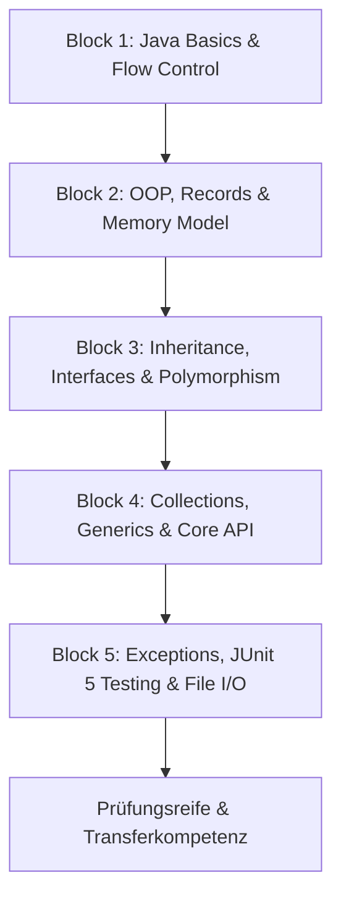

# Requirements

### Overview & Goals
Ziel dieses Plans ist es, die vollständigen Kompetenzen und Lerninhalte des Moduls **Java Fundamentals (JAF)** der FFHS (5 ECTS, 150 h) systematisch, praxisorientiert und prüfungsrelevant aufzubauen. 

Um den maximalen Lernerfolg, nachhaltige Problemlösungskompetenz und Prüfungssicherheit (SP 70%, EN 30%) sicherzustellen, basiert die Begleitung auf dem Prinzip des **aktiven Selbstprogrammierens**:
1. Der Lernende erhält gezielte Aufgabenstellungen, Kontext und Anforderungen.
2. Der Lernende schreibt den Code eigenständig und sammelt unmittelbare praktische Erfahrung.
3. Der Assistent analysiert die eingereichten Zwischenergebnisse, gibt konstruktives Feedback und stellt weiterführende Fragen oder Denkanstösse bereit.
4. Musterlösungen werden ausschliesslich auf explizite Aufforderung präsentiert, um den kognitiven Lerneffekt und den Wissensertrag zu maximieren.

### Scope
- **In Scope**:
  - Alle 5 Kernblöcke des offiziellen Modulplans JAF:
    1. *Einführung in Java*: IDE, JVM-Grundlagen, Primitive Typen, Operatoren, Kontrollfluss, erste Klassen/Methoden, Maven.
    2. *Objektorientierte Programmierung*: Klassenbeziehungen (hat-ein), Attribute/Methoden/Konstruktoren, Stack vs. Heap, Records, final, Arrays, ArrayList, JavaDoc, enum, Pakete.
    3. *Vererbung und Interfaces*: Klassenhierarchien, Sichtbarkeitsmodifikatoren, Interfaces, abstrakte Klassen, Polymorphie, Lambda-Ausdrücke, Designentscheidungen.
    4. *Datenstrukturen & Java-API*: Collections Framework (`List`, `Set`, `Map`), Generics, Iteratoren, String/Math/Collections Hilfsklassen, statische vs. Instanz-Member.
    5. *Fehlerbehandlung, Testing & I/O*: `try-catch-finally`, Checked vs. Unchecked Exceptions, eigene Exceptions, `Optional`, JUnit 5 Tests, Datei-I/O.
  - Gezielte Vorbereitung auf die Kurztests (24%) und die schriftliche Modulprüfung (70%) gemäss KI-Policy (Beherrschung ohne KI-Tools unter Prüfungsbedingungen).
- **Out of Scope**:
  - Fortgeschrittene Frameworks (Spring Boot, Hibernate/JPA, JavaFX/Swing UI-Frameworks), da diese Gegenstand nachfolgender Module (SWEM, JPL, WebE) sind.

### User Stories
- **Als Student** möchte ich Schritt für Schritt mit präzisen Übungen angeleitet werden, damit ich die Grundlagen der imperativen und objektorientierten Programmierung fundiert verstehe.
- **Als Student** möchte ich den Code selbst erarbeiten und testen, damit ich für prüfungsrelevante Aufgabenstellungen eigenständige Lösungsroutinen entwickle.
- **Als Student** möchte ich fundierte Erklärungen zu Kernkonzepten (z. B. Referenz- vs. Werttypen, Heap vs. Stack, Polymorphie) erhalten, damit ich Designentscheide fachlich begründen kann.

# Technical Design

### Current Implementation & Codebase Context
- Aktueller Stand: Basis-Java-Projekt mit Single-Source-Einstieg (`src/Main.java`) und IntelliJ IDEA-Konfiguration (`Java-Fundamentals.iml`, `.idea/`).
- Zielstruktur: Systematischer Ausbau nach standardisierten Maven-Konventionen und modularen Packages pro Lernblock.

### Key Decisions
1. **Didaktischer Leitfaden (Scaffolding & Guided Discovery)**:
   - *Entscheid*: Strikte Trennung zwischen Aufgabenstellung/Konzeptvermittlung und Code-Generierung. 
   - *Begründung*: Maximiert den Lerneffekt und verhindert passive Rezeption. Der Lernende erlangt Routine in Syntax und Konzeption.
2. **Paket- und Modulstruktur nach Themenblöcken**:
   - *Entscheid*: Strukturierung des Codes unter `ch.ffhs.jaf` mit Subpackages (`block1_basics`, `block2_oop`, `block3_inheritance`, `block4_collections`, `block5_robustness`).
   - *Begründung*: Ermöglicht klare Trennung, einfache Navigation und dient als dauerhaftes Nachschlagewerk während der Prüfungsvorbereitung.
3. **Praxisnahe Mini-Szenarien**:
   - *Entscheid*: Verwendung zusammenhängender, realistischer Domänenmodelle (z. B. Verwaltungssystem für eine Bibliothek oder einen Onlineshop), die über die Blöcke hinweg schrittweise verfeinert und refaktoriert werden.
   - *Begründung*: Ermöglicht das Erleben von Refactoring- und Architekturverbesserungen (z. B. Ablösung von Arrays durch Collections, Einführung von Interfaces).

### Architecture & Progression Model


### Proposed Package Structure
```
src/
└── ch/
    └── ffhs/
        └── jaf/
            ├── block1_basics/       # Primitive Typen, Kontrollfluss, erste Methoden
            ├── block2_oop/          # Klassen, Konstruktoren, Records, Enums, ArrayList
            ├── block3_inheritance/  # Interfaces, Vererbung, Polymorphismus, Lambdas
            ├── block4_collections/  # List, Set, Map, Generics, Java Standard API
            └── block5_robustness/   # Exceptions, JUnit 5 Tests, File I/O
```

# Testing

### Validation Approach
- **Kompilierbarkeit und Fehlerfreiheit**: Jeder vom Benutzer geschriebene Code muss sauber kompilieren und der Java-Syntax folgen.
- **Konzeptprüfung durch Transferfragen**: Am Ende jedes Blocks wird das theoretische Verständnis durch gezielte Fragen (z. B. "Warum wirft dieser Code eine NullPointerException?", "Was passiert im Heap bei Zuweisung `a = b`?") validiert.
- **Automatisierte Validierung**: Ab Block 5 Überprüfung der Funktionalität mittels reproduzierbarer JUnit 5 Testfälle.

### Key Scenarios per Block
1. **Block 1**: Korrekte Anwendung arithmetischer Operatoren, Typkonvertierungen, Schleifenabbruchbedingungen und Verzweigungen.
2. **Block 2**: Richtige Kapselung (private Attribute, Getter/Setter/Record-Komponenten), Referenzgleichheit (`==` vs `.equals()`), dynamisches Hinzufügen/Entfernen in `ArrayList`.
3. **Block 3**: Polymorphe Methodenaufrufe über Interface- bzw. Superklassen-Referenzen, korrekte `super()`-Verkettung, syntaktisch korrekte Lambdas.
4. **Block 4**: Vermeidung von Duplikaten mit `Set`, Schlüssel-Wert-Zuordnungen mit `Map`, typsichere Generics ohne Raw-Types.
5. **Block 5**: Sauberes Abfangen und Weiterleiten von Exceptions, Ressourcenfreigabe mit `try-with-resources`, 100% grüne JUnit 5 Tests für Kernfunktionalitäten.

# Delivery Steps

### * Step 1: Block 1: Java-Grundlagen und Kontrollfluss
Lernende beherrschen die JVM-Grundlagen, elementare Java-Syntax, primitive Datentypen, Operatoren, Kontrollstrukturen und einfache Methoden-/Klassenstrukturen im Projekt.

- Umwandlung des Basisprojekts in eine saubere Paket- und Maven-Struktur (`ch.ffhs.jaf.block1`).
- Interaktive Übungen zu primitiven Datentypen (`int`, `double`, `boolean`, `char`), Typumwandlungen (Casting) und Autoboxing/Wrapper-Klassen.
- Implementierung von Kontrollflussaufgaben (Verzweigungen mit `if`/`else`, `switch`-Statements, Schleifen mit `for`, `while`, `do-while`).
- Entwurf erster eigenständiger Methoden und grundlegender Klassen mit Instanzvariablen und Konstruktoren.
- Praktische Übung im Debugging und Ausführen in IntelliJ IDEA zur Fehlerlokalisierung.

###   Step 2: Block 2: Objektorientierte Programmierung und Kapselung
Lernende können reale Domänenprobleme in objektorientierte Klassenmodelle mit Attributen, Kapselung, Records, Enums und dynamischen Objektlisten (`ArrayList`) überführen.

- Modellierung von Klassenbeziehungen (Assoziation, Aggregation, Komposition / "hat-ein"-Beziehungen) im Paket `ch.ffhs.jaf.block2`.
- Veranschaulichung und praktische Überprüfung von Speicherverwaltung (Stack vs. Heap, Referenzen vs. Werte).
- Implementierung von unveränderlichen Datenstrukturen mit Java Records und dem `final`-Schlüsselwort.
- Einsatz strukturierter Datensammlungen mit festen Arrays und dynamischen `ArrayList`-Objekten.
- Strukturierung des Codes mit Enums und Paketen sowie Dokumentation relevanter Schnittstellen via JavaDoc.

###   Step 3: Block 3: Vererbung, Interfaces und Polymorphie
Lernende setzen Vererbung, abstrakte Klassen, Schnittstellen (Interfaces) und funktionale Programmierung (Lambdas) zielgerichtet für erweiterbaren Code ein.

- Aufbau von Klassenhierarchien mit `extends`, Methodenüberschreibung (`@Override`) und Aufrufen von `super` im Paket `ch.ffhs.jaf.block3`.
- Feinabstufung von Kapselung und Sichtbarkeit (`public`, `protected`, package-private, `private`).
- Entwurf und Implementierung von Schnittstellen (`interface`) und abstrakten Basisklassen (`abstract class`) mit fundierter Abwägung (Vererbung vs. Komposition/Interface).
- Anwendung von dynamischer Bindung und Polymorphismus in flexiblen Geschäftslogiken.
- Einführung funktionaler Interfaces und kompakter Lambda-Ausdrücke für prägnantere Datenverarbeitung.

###   Step 4: Block 4: Java Collections Framework und Core API
Lernende wählen die optimalen Collections (List, Set, Map) typsicher mit Generics aus und nutzen die Standard-Java-API effizient.

- Implementierung und Vergleichen konkreter Collections aus `java.util` (`ArrayList`, `HashSet`, `TreeSet`, `HashMap`, `TreeMap`) im Paket `ch.ffhs.jaf.block4`.
- Einsatz typsicherer Generics und Durchlaufen von Sammlungen via `Iterator` und erweiterter `for-each`-Schleife.
- Gezielte Verwendung zentraler Java-APIs (`java.lang.String`, `java.lang.StringBuilder`, `java.lang.Math`, `java.util.Collections`, `java.util.Arrays`).
- Gegenüberstellung und gezielter Einsatz statischer Klassenmitglieder (`static`) vs. Instanzmitglieder.

###   Step 5: Block 5: Robuste Programmierung (Exceptions, Testing, I/O)
Lernende erstellen ausfallsichere, testbare Anwendungen mit strukturierter Exception-Behandlung, JUnit 5 Unit-Tests, null-Sicherheit und Datei-Persistenz.

- Implementierung strukturierter Fehlerbehandlung (`try-catch-finally`, `try-with-resources`) sowie Unterscheidung von Checked und Unchecked Exceptions im Paket `ch.ffhs.jaf.block5`.
- Definition eigener fachlicher Exception-Klassen zur präzisen Fehlerkommunikation.
- Robuster Umgang mit `null` unter Verwendung moderner Sprachmittel wie `java.util.Optional`.
- Erstellung automatisierter Unit-Tests mit JUnit 5 (`@Test`, Assertions wie `assertEquals`, `assertThrows`, Testlebenszyklus).
- Implementierung von Datei-I/O zum persistenten Lesen und Schreiben von Textdateien (`java.nio.file.Files`, `BufferedReader`, `BufferedWriter`).